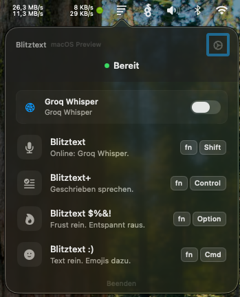
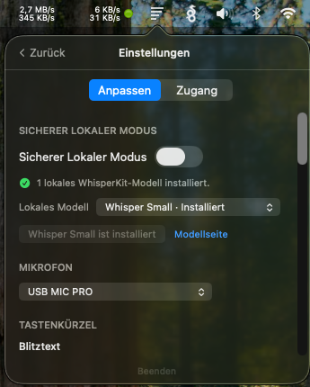
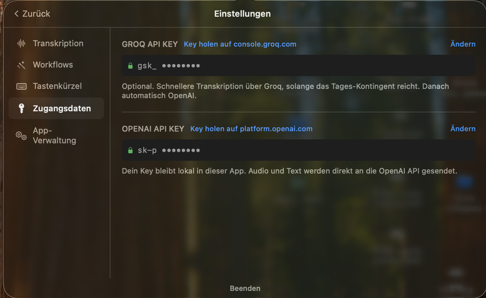
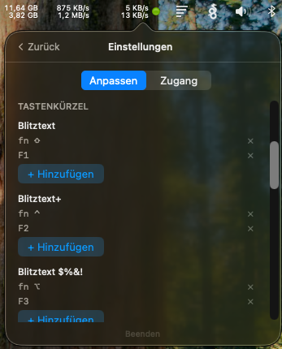

# Turbotext

Turbotext is a fork of [turbotext-app](https://github.com/cmagnussen/turbotext-app) by cmagnussen — an experimental open-source macOS menubar app for turning speech into text.

> Turbotext — Groq-powered transcription with configurable hotkeys & mic

This fork adds Groq as a transcription backend (faster and cheaper than OpenAI Whisper), makes hotkeys configurable per workflow, allows selecting the input microphone, and enables hotkeys on external USB keyboards.

## What's Different From The Original

- **Groq transcription** — uses Groq's `whisper-large-v3-turbo` instead of OpenAI `whisper-1`. Significantly faster and cheaper. Bring your own Groq API key (free tier available).
- **Configurable hotkeys** — each workflow (transcribe, rewrite, etc.) gets its own assignable hotkey. No more fixed key bindings.
- **Microphone selection** — choose any connected input device, not just the system default.
- **External keyboard support** — hotkeys work on USB keyboards, not just the built-in Apple keyboard. Requires the Input Monitoring permission (see Permissions below).

## What It Does

- **Turbotext**: record speech and transcribe it.
- **Turbotext+**: record speech, transcribe it, then turn the rough draft into cleaner writing.
- **Turbotext $%&!**: turn frustrated speech into a calmer message.
- **Turbotext :)**: add fitting emojis to dictated text.

## Important Preview Notes

- macOS only.
- Bring your own Groq API key for transcription (and optionally OpenAI for rewriting).
- No hosted backend is included or provided.
- Audio is sent directly from the app to the Groq API for transcription.
- Optional local transcription via WhisperKit/CoreML if you install a compatible model locally.
- `./build.sh` creates a locally ad-hoc-signed development app. No notarized release binary is provided.
- Not production ready. No warranty and no support guarantee.

You are welcome to use, fork, adapt, and share this project under the license terms.

## Screenshots

<table>
  <tr>
    <td></td>
    <td></td>
  </tr>
  <tr>
    <td></td>
    <td></td>
  </tr>
</table>

## Requirements

- macOS 14 or newer
- Xcode 16 or newer (Swift 5.10), with Command Line Tools installed and selected for `xcodebuild`
- [XcodeGen](https://github.com/yonaskolb/XcodeGen) to generate the Xcode project
- **Groq API key** for transcription — get one at [console.groq.com](https://console.groq.com) (free tier available)
- **OpenAI API key** (optional) for rewriting workflows:
  - `gpt-4o-mini` and optionally `gpt-4o`
- For local-only transcription: a WhisperKit CoreML model in:
  `~/Library/Application Support/Turbotext/models/whisperkit/`

The build pulls one Swift Package dependency automatically:

- [`argmax-oss-swift`](https://github.com/argmaxinc/argmax-oss-swift) (WhisperKit) — for local on-device transcription.

Install XcodeGen if needed:

```bash
brew install xcodegen
```

## Build And Run

```bash
git clone https://github.com/matthiasgruenwald/turbotext.git
cd turbotext
./build.sh --run
```

For a local install into `/Applications`:

```bash
./build.sh --install --run
```

The generated `.app` is ad-hoc signed for local development only.

On first launch, paste your Groq API key in Settings for transcription. Optionally add an OpenAI key for rewriting workflows.

For fully local transcription, install a WhisperKit CoreML model and enable **Sicherer Lokaler Modus** in the app.

For a detailed walkthrough, see [docs/setup.md](docs/setup.md).

## Permissions

Turbotext asks for:

- **Microphone**: to record your voice.
- **Accessibility**: to paste the result back into the app you were using.
- **Input Monitoring**: required for hotkeys on external USB keyboards.

### Input Monitoring (External Keyboards)

macOS requires explicit approval to read key events from non-Apple keyboards. If your hotkeys only work on the built-in Apple keyboard, grant Input Monitoring:

**System Settings → Privacy & Security → Input Monitoring → enable Turbotext**

Then restart the app.

If you use only the built-in keyboard, this permission is not needed.

### Accessibility (Auto-Paste)

If auto-paste does not work after transcription: open **System Settings → Privacy & Security → Accessibility**, enable Turbotext, restart, and try again with the cursor in a text field. If multiple Turbotext entries appear, remove old ones and grant permission to the freshly built app.

## Data Flow

```text
Transcription:     Your Mac → Groq API (whisper-large-v3-turbo)
Text rewriting:    Your Mac → OpenAI Chat Completions API
Local transcription: Your Mac → WhisperKit/CoreML on device
```

API keys are stored in the macOS Keychain.

Read [docs/privacy.md](docs/privacy.md) before using with sensitive content.

## Project Structure

```text
TurbotextMac/
  App/          App lifecycle and paste handling
  Features/     Workflows, menu bar UI, settings
  Services/     Recording, Groq/OpenAI calls, hotkeys, local storage
  Views/        Shared SwiftUI views
build.sh        Local build script
docs/           Setup, privacy, roadmap
```

## Local Models

Local transcription via WhisperKit/CoreML is available as an experimental path. The app does not bundle a model; choose one in the app, click install, then switch on **Sicherer Lokaler Modus**.

See [docs/local-models.md](docs/local-models.md).

## Contributing

Contributions are welcome.

Please read [CONTRIBUTING.md](CONTRIBUTING.md) first.

## License

Code is released under the MIT License. See [LICENSE](LICENSE).

Project names, logos, and app icons are not automatically granted as trademarks or brand assets. See [TRADEMARKS.md](TRADEMARKS.md).
